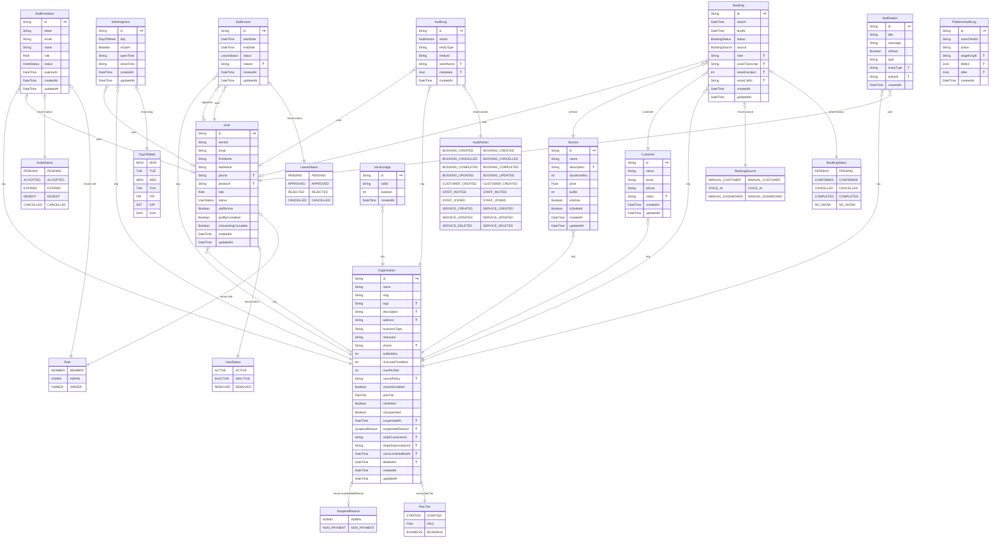

```mermaid
erDiagram

        Role {
            MEMBER MEMBER
ADMIN ADMIN
OWNER OWNER
        }
    


        BookingStatus {
            PENDING PENDING
CONFIRMED CONFIRMED
CANCELLED CANCELLED
COMPLETED COMPLETED
NO_SHOW NO_SHOW
        }
    


        BookingSource {
            MANUAL_CUSTOMER MANUAL_CUSTOMER
VOICE_AI VOICE_AI
MANUAL_DASHBOARD MANUAL_DASHBOARD
        }
    


        PlanTier {
            STARTER STARTER
PRO PRO
BUSINESS BUSINESS
        }
    


        SuspendReason {
            ADMIN ADMIN
NON_PAYMENT NON_PAYMENT
        }
    


        InviteStatus {
            PENDING PENDING
ACCEPTED ACCEPTED
EXPIRED EXPIRED
RESENT RESENT
CANCELLED CANCELLED
        }
    


        UserStatus {
            ACTIVE ACTIVE
INACTIVE INACTIVE
REMOVED REMOVED
        }
    


        DayOfWeek {
            MON MON
TUE TUE
WED WED
THU THU
FRI FRI
SAT SAT
SUN SUN
        }
    


        LeaveStatus {
            PENDING PENDING
APPROVED APPROVED
REJECTED REJECTED
CANCELLED CANCELLED
        }
    


        AuditAction {
            BOOKING_CREATED BOOKING_CREATED
BOOKING_CANCELLED BOOKING_CANCELLED
BOOKING_COMPLETED BOOKING_COMPLETED
BOOKING_UPDATED BOOKING_UPDATED
CUSTOMER_CREATED CUSTOMER_CREATED
STAFF_INVITED STAFF_INVITED
STAFF_JOINED STAFF_JOINED
SERVICE_CREATED SERVICE_CREATED
SERVICE_UPDATED SERVICE_UPDATED
SERVICE_DELETED SERVICE_DELETED
        }
    
  "Organisation" {
    String id "🗝️"
    String name 
    String slug 
    String logo "❓"
    String description "❓"
    String address "❓"
    String businessType 
    String timezone 
    String phone "❓"
    Int bufferMins 
    Int minLeadTimeMins 
    Int maxPerSlot 
    String cancelPolicy "❓"
    Boolean voiceAiEnabled 
    PlanTier planTier 
    Boolean isDeleted 
    Boolean isSuspended 
    DateTime suspendedAt "❓"
    SuspendReason suspendedReason "❓"
    String stripeCustomerId "❓"
    String stripeSubscriptionId "❓"
    DateTime voiceLimitNotifiedAt "❓"
    DateTime deletedAt "❓"
    DateTime createdAt 
    DateTime updatedAt 
    }
  

  "User" {
    String id "🗝️"
    String clerkId 
    String email 
    String firstName 
    String lastName 
    String phone "❓"
    String photoUrl "❓"
    Role role 
    UserStatus status 
    Boolean staffActive 
    Boolean profileComplete 
    Boolean onboardingComplete 
    DateTime createdAt 
    DateTime updatedAt 
    }
  

  "Service" {
    String id "🗝️"
    String name 
    String description "❓"
    Int durationMins 
    Float price 
    Int buffer 
    Boolean isActive 
    Boolean isDeleted 
    DateTime createdAt 
    DateTime updatedAt 
    }
  

  "VoiceUsage" {
    String id "🗝️"
    String callId 
    Int duration 
    DateTime createdAt 
    }
  

  "Customer" {
    String id "🗝️"
    String name 
    String email 
    String phone 
    String notes "❓"
    DateTime createdAt 
    DateTime updatedAt 
    }
  

  "Booking" {
    String id "🗝️"
    DateTime startAt 
    DateTime endAt 
    BookingStatus status 
    BookingSource source 
    String note "❓"
    String voiceTranscript "❓"
    Int voiceDuration "❓"
    String voiceCallId "❓"
    DateTime createdAt 
    DateTime updatedAt 
    }
  

  "AuditLog" {
    String id "🗝️"
    AuditAction action 
    String entityType 
    String entityId 
    String actorName "❓"
    Json metadata "❓"
    DateTime createdAt 
    }
  

  "Notification" {
    String id "🗝️"
    String title 
    String message 
    Boolean isRead 
    String type 
    String entityType "❓"
    String entityId "❓"
    DateTime createdAt 
    }
  

  "StaffInvitation" {
    String id "🗝️"
    String token 
    String email 
    String name 
    Role role 
    InviteStatus status 
    DateTime expiresAt 
    DateTime createdAt 
    DateTime updatedAt 
    }
  

  "WorkingHour" {
    String id "🗝️"
    DayOfWeek day 
    Boolean isOpen 
    String openTime 
    String closeTime 
    DateTime createdAt 
    DateTime updatedAt 
    }
  

  "StaffLeave" {
    String id "🗝️"
    DateTime startDate 
    DateTime endDate 
    LeaveStatus status 
    String reason "❓"
    DateTime createdAt 
    DateTime updatedAt 
    }
  

  "PlatformAuditLog" {
    String id "🗝️"
    String actorClerkId 
    String action 
    String targetOrgId "❓"
    Json before "❓"
    Json after "❓"
    DateTime createdAt 
    }
  
    "Organisation" |o--|| "PlanTier" : "enum:planTier"
    "Organisation" |o--|o "SuspendReason" : "enum:suspendedReason"
    "User" |o--|| "Role" : "enum:role"
    "User" |o--|| "UserStatus" : "enum:status"
    "User" }o--|o "Organisation" : "org"
    "Service" }o--|| "Organisation" : "org"
    "VoiceUsage" }o--|| "Organisation" : "org"
    "Customer" }o--|| "Organisation" : "org"
    "Booking" |o--|| "BookingStatus" : "enum:status"
    "Booking" |o--|| "BookingSource" : "enum:source"
    "Booking" }o--|| "Organisation" : "org"
    "Booking" }o--|| "Customer" : "customer"
    "Booking" }o--|| "Service" : "service"
    "Booking" }o--|o "User" : "user"
    "AuditLog" |o--|| "AuditAction" : "enum:action"
    "AuditLog" }o--|| "Organisation" : "org"
    "AuditLog" }o--|o "User" : "user"
    "Notification" }o--|| "User" : "user"
    "Notification" }o--|| "Organisation" : "org"
    "StaffInvitation" |o--|| "Role" : "enum:role"
    "StaffInvitation" |o--|| "InviteStatus" : "enum:status"
    "StaffInvitation" |o--|o "User" : "user"
    "StaffInvitation" }o--|| "Organisation" : "org"
    "WorkingHour" |o--|| "DayOfWeek" : "enum:day"
    "WorkingHour" }o--|| "Organisation" : "org"
    "WorkingHour" }o--|o "User" : "user"
    "StaffLeave" |o--|| "LeaveStatus" : "enum:status"
    "StaffLeave" }o--|| "User" : "user"
    "StaffLeave" }o--|o "User" : "approver"
    "StaffLeave" }o--|| "Organisation" : "org"
```
